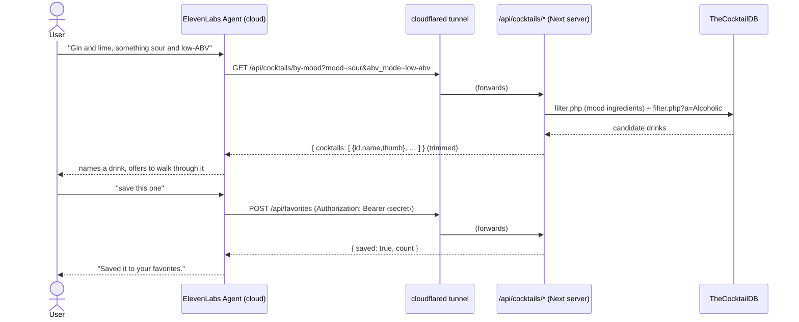
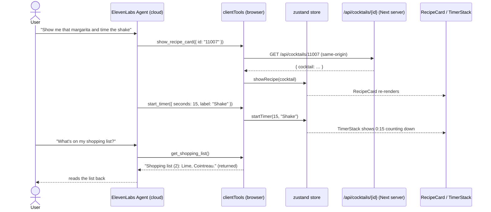
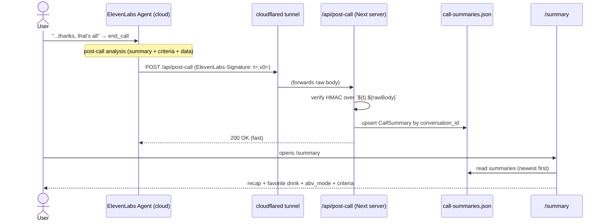
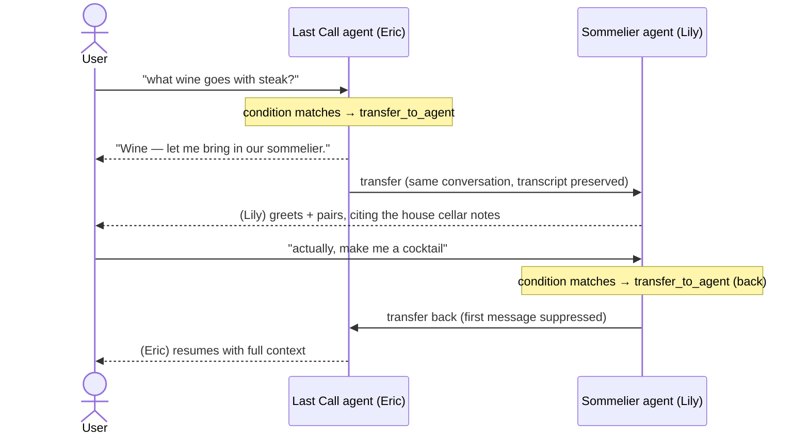
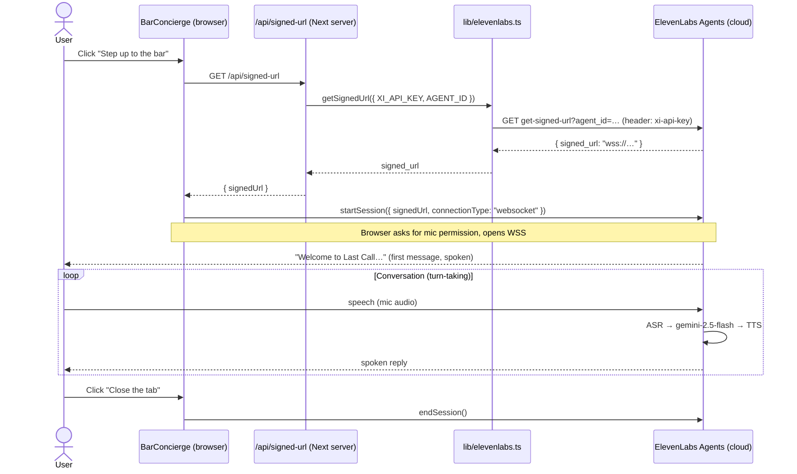

# Architecture & Workflow — Last Call

How the app is wired today (through Phase 6 + the production deploy), what happens when
a user interacts with it, and where each piece of code lives. For the multi-phase plan
see [plan.md](plan.md); for build history and how to continue see [HANDOFF.md](HANDOFF.md);
for the deploy runbook see [DEPLOYMENT.md](DEPLOYMENT.md).

> **Live in production:** <https://ai-mixologist-elevenlabs.vercel.app> (Vercel + Upstash
> Redis). The diagrams below show the local-dev wiring, where the public URL that
> ElevenLabs' cloud calls is a **cloudflared tunnel**. **In production that public URL is
> the stable Vercel domain instead** — everything else is identical, and the same code
> serves both (see [Production deployment](#production-deployment-vercel--upstash)).

---

## The big picture

Three actors are involved in every conversation:

1. **The browser** — runs the Next.js page and the `@elevenlabs/react` voice widget.
   It captures the mic and plays the agent's audio.
2. **Our Next.js server** — a single API route that mints a signed URL. It is the
   only place the ElevenLabs API key ever exists.
3. **ElevenLabs Agents (cloud)** — runs the actual agent: speech-to-text →
   `gemini-2.5-flash` LLM → low-latency text-to-speech, plus turn-taking.

```
┌─────────────────────────── Browser ───────────────────────────┐
│  app/page.tsx                                                  │
│    └─ components/BarConcierge.tsx   (@elevenlabs/react)        │
│         • "Step up to the bar" button                          │
│         • useConversationControls() → startSession/endSession  │
│         • useConversationStatus()   → status + error message   │
│              │                              ▲                  │
│        (1) GET /api/signed-url        (4) WSS audio stream      │
└──────────────┼──────────────────────────────┼─────────────────┘
               │                              │
               ▼                              │
┌────────── Next.js server ──────────┐        │
│  app/api/signed-url/route.ts        │        │
│    └─ lib/elevenlabs.ts             │        │
│         getSignedUrl({apiKey,       │        │
│           agentId})                 │        │
│              │                      │        │
│   (2) GET get-signed-url            │        │
│       header: xi-api-key  ──────────┼────────┼──┐
│   reads process.env.XI_API_KEY      │        │  │
│        AGENT_ID                     │        │  │
└─────────────────────────────────────┘        │  │
                                                │  │
┌──────────── ElevenLabs Agents (cloud) ────────┼──▼──────────────┐
│  (3) returns { signed_url }  ──────────────────┘                │
│  Agent  agent_1301kswshvrjfaz954ft54a2z0n3  (Last Call, Eric)   │
│    • persona / first message / guardrails (from agent_configs)  │
│    • LLM: gemini-2.5-flash                                      │
│    • TTS: eleven_flash_v2, voice cjVigY5qzO86Huf0OWal           │
│    • ASR + turn-taking                                          │
│         ⇅ transfer_to_agent (Phase 6, wine ↔ cocktails)         │
│  Agent  agent_0501kt0h021gfs48zhaaah99ec9n  (Sommelier, Lily)   │
│    • own persona / voice / wine KB — reached only via transfer  │
└──────────────────────────────────────────────────────────────┘
```

**Why mint a signed URL instead of connecting directly?** The signed URL lets the
browser open a private WebSocket to the agent **without ever seeing the API key**.
The key stays server-side (`process.env.XI_API_KEY`); the browser receives only a
short-lived, single-use URL.

---

## Server tools (Phase 2) — how the agent fetches real data

Phase 2 gives the agent 6 **webhook tools**. Crucially, these are called by the
**ElevenLabs cloud**, not the browser — so they hit a *public* URL, not `localhost`.
In dev that public URL is a **cloudflared quick tunnel** to the Next.js server.

```
┌─ ElevenLabs Agents (cloud) ─┐        ┌─ cloudflared ─┐       ┌─ Next.js server (localhost:3000) ─┐
│  agent decides to call a    │        │  public URL   │       │  app/api/cocktails/* ─┐            │
│  tool (e.g. suggest_by_mood)│──HTTP─▶│ *.trycloud... │──────▶│  app/api/favorites    │            │
│  using tool_configs/*.json  │        └───────────────┘       │     └─ lib/cocktaildb.ts ──┐       │
│  url = $PUBLIC_BASE_URL/...  │◀──────── trimmed JSON ─────────│        lib/favorites.ts    │       │
└─────────────────────────────┘                                │           │                │       │
                                                                │   GET TheCocktailDB (search/filter/lookup/random)
                                                                └────────────────────────────────────┘
```

- **Why proxy** instead of pointing tools straight at TheCocktailDB: (1) reshape/trim
  the verbose payloads to just what the LLM needs, (2) `suggest_by_mood` adds real
  server logic (curated mood→ingredient map + ABV intersection), (3) one auth/logging
  boundary we control.
- **The tools, as code:** [`tool_configs/*.json`](tool_configs) define each webhook
  (url, method, params, descriptions); [`tools.json`](tools.json) maps them to remote
  ids; the agent references those ids in `prompt.tool_ids`. Push order:
  `elevenlabs tools push` → copy ids into the agent → `elevenlabs agents push`.
- **`save_favorite` auth:** the tool sends `Authorization: Bearer <secret>` where the
  value is an **ElevenLabs workspace secret** referenced by `secret_id` (never written
  into the committed config). [`app/api/favorites/route.ts`](app/api/favorites/route.ts)
  constant-time-compares it against `TOOL_SHARED_SECRET` and 401s on mismatch.
- **Reshaping** lives in [`lib/cocktaildb.ts`](lib/cocktaildb.ts): `toCocktailDetail`
  zips the flat `strIngredient1..15`/`strMeasure1..15` slots into a clean
  `ingredients[]`; list endpoints return slim `{id,name,thumb}` summaries.

### What happens on a tool call (golden path)



---

## Client tools (Phase 3) — how the agent drives the screen

Where server tools are called by the ElevenLabs **cloud**, client tools run in the
**browser**. The agent can't draw on the page, so it calls named client tools that
mutate a small **zustand** store ([lib/store.ts](lib/store.ts)); the React panels
subscribe and re-render. No tunnel is involved — these execute in the user's tab.

```
┌─ ElevenLabs Agents (cloud) ─┐                 ┌──────────── Browser ────────────┐
│  agent decides to call a    │   client-tool   │  BarConcierge registers          │
│  client tool, e.g.          │──invocation────▶│  startSession({ clientTools })   │
│  show_recipe_card({id})     │   (over WSS)    │     └─ lib/clientTools.ts         │
│                             │◀──return value──│        └─ mutates lib/store.ts ───┼─┐
└─────────────────────────────┘  (get_shopping_ │  zustand store                   │ │
                                  list only)     └──────────────────────────────────┘ │
                                                    RecipeCard / TimerStack /          │
                                                    ShoppingList / Dashboard ◀─────────┘
                                                    (subscribe + re-render)
```

- **The five tools** ([lib/clientTools.ts](lib/clientTools.ts), configs in
  [tool_configs/](tool_configs)): `show_recipe_card`, `start_timer`,
  `add_to_shopping_list`, `set_ambiance`, and `get_shopping_list` — the only one that
  **returns a value** to the agent (its config sets `expects_response: true`, so the
  agent can read the list back). Tool + parameter **names must match exactly** between
  the config and the handler; that's the invocation contract.
- **Registration:** [BarConcierge.tsx](components/BarConcierge.tsx) builds the
  `clientTools` map via `buildClientTools({ store })` and passes it to
  `startSession({ clientTools })`. The handlers read the latest state through the
  store's `getState()`, so the map is built once.
- **`show_recipe_card` reuses Phase 2:** when given a TheCocktailDB `id` it fetches the
  canonical recipe from our own [/api/cocktails/{id}](app/api/cocktails/[id]/route.ts)
  **same-origin** (accurate specs, lighter LLM payload); it falls back to inline params
  only for an improvised drink with no id.
- **State & persistence:** the store keeps `recipe`, `timers`, `shoppingList`,
  `ambiance`. The **shopping list + ambiance persist to localStorage** (zustand
  `persist`); the recipe and timers are session-only. `skipHydration` + a mount-time
  rehydrate keep the server and first client render in sync.
- **Ambiance** ([lib/ambiance.ts](lib/ambiance.ts)) themes the whole dashboard —
  `speakeasy` / `tiki` / `bright` — set by the `set_ambiance` voice tool **or** by clicking
  the header [ThemeSwitcher](components/ThemeSwitcher.tsx). Both write the same store key,
  so voice and click stay in sync.
- **Timer bell** ([lib/sound.ts](lib/sound.ts)): when a countdown crosses to "Done!",
  `TimerStack` plays a short synthesized Web Audio chime (no audio asset). It's a
  guarded nice-to-have — a missing/blocked AudioContext no-ops without affecting the UI.

### A client-tool turn (golden path)



---

## System tools, knowledge base & personalization (Phase 4)

Phase 4 adds three capabilities that live almost entirely **on the agent config**
(plus one small browser piece for personalization).

```
┌──────────── Browser ────────────┐         ┌─────────── ElevenLabs Agents (cloud) ───────────┐
│ PreCallForm (optional)           │         │ prompt.built_in_tools: end_call / language_      │
│  → buildDynamicVariables()       │ start   │   detection / skip_turn   (run inside the agent) │
│  → startSession({                │ Session │ prompt.knowledge_base[bartending-101] + rag      │
│      dynamicVariables })  ───────┼────────▶│   .enabled → RAG retrieval at answer time        │
│                                  │         │ conversation.source_attribution → cites sources  │
└──────────────────────────────────┘         │ {{user_name}}/{{taste_profile}}/{{abv_mode}}/    │
                                              │   {{available_spirits}} resolved from dyn vars   │
                                              │   (or placeholder defaults if the form is skipped)│
                                              └──────────────────────────────────────────────────┘
```

- **System tools** ([built_in_tools](agent_configs/Last-Call.json)) are *not* webhook/client
  tools and never appear in `tool_ids`. They're declared inline by slot
  (`end_call`/`language_detection`/`skip_turn`), each `{ name, description, params:{ system_tool_type } }`,
  and execute inside the ElevenLabs runtime — no code of ours runs. `language_detection`
  switches the conversation language (Spanish is registered via `language_presets`; English
  stays primary on `eleven_flash_v2`, and the platform auto-promotes to the multilingual model
  on a switch). The `# Conversation flow` prompt section guides when to use each.
- **Knowledge base + RAG:** [knowledge-base/bartending-101.md](knowledge-base/bartending-101.md)
  is uploaded + RAG-indexed through the ElevenLabs **REST API** (the CLI has no KB commands),
  then attached on the agent (`prompt.knowledge_base` with `usage_mode:"auto"` +
  `prompt.rag.enabled=true`). At answer time the agent retrieves relevant chunks for technique
  / substitution questions; `conversation.source_attribution=true` makes it cite the house guide.
- **Dynamic variables:** the optional [PreCallForm](components/PreCallForm.tsx) feeds
  [buildDynamicVariables](lib/personalization.ts), which passes a value for **every** variable to
  `startSession({ dynamicVariables })` — the guest's input where filled, else a default string
  (SDK accepts primitives only, so the spirits list is comma-joined). The prompt + first message
  reference `{{…}}`. **Why client-side defaults, not placeholders:** `dynamic_variable_placeholders`
  only seed the dashboard test UI — they do **not** fill a referenced `{{var}}` in a live session
  (verified live: a skip-form call failed on `{{user_name}}` despite placeholders being set), so the
  client must always supply a concrete value. **Deploy gotcha:** `elevenlabs agents push`
  (CLI 0.5.3) drops those placeholders (it camelCases the map keys), so
  [scripts/apply-agent-placeholders.mjs](scripts/apply-agent-placeholders.mjs) re-applies them
  via a REST PATCH — wired into `npm run agent:push`.

---

## Post-call webhook & analytics (Phase 5) — how a call becomes a summary

After every conversation ends, ElevenLabs' cloud runs post-call analysis and **POSTs a
signed payload** to our `/api/post-call` route. Like the Phase 2 server tools, this route
is called by the **cloud**, so it needs a public URL (the cloudflared tunnel). We verify
the signature, distill the payload, persist it, and render it on `/summary`.

```
┌─ ElevenLabs Agents (cloud) ─┐        ┌─ cloudflared ─┐      ┌─ Next.js server (localhost:3000) ──────┐
│ call ends → post-call        │        │  public URL   │      │ app/api/post-call/route.ts             │
│ analysis (summary +          │        │ *.trycloud... │      │   └─ lib/postcall.ts                    │
│ evaluation_criteria +        │──POST─▶│               │─────▶│       verifyPostCallSignature (HMAC)    │
│ data_collection)             │ signed │               │      │       toCallSummary (reshape)           │
│ ElevenLabs-Signature: t=,v0= │        └───────────────┘      │   └─ lib/callSummaries.ts (upsert) ─┐   │
└─────────────────────────────┘   200 OK ◀───────────────────  │      .data/call-summaries.json      │   │
                                                                └────────────────────────────────────┼───┘
   /summary (server component) ◀── reads the store ──────────────────────────────────────────────────┘
```

- **HMAC verification** ([lib/postcall.ts](lib/postcall.ts)): the `ElevenLabs-Signature`
  header is `t=<unix_seconds>,v0=<hex>`; the hash is HMAC-SHA256 over
  `` `${timestamp}.${rawBody}` `` against `POSTCALL_WEBHOOK_SECRET`, with a 30-minute
  replay window. We reimplement the SDK's scheme exactly (constant-time compare) rather than
  pull in the full SDK client, keeping it pure + unit-testable. The route reads the **raw**
  body (`req.text()`, never `req.json()`) so the bytes match what was signed, and returns a
  generic **401** on any failure (the real reason is logged, not leaked).
- **What ElevenLabs analyzes** is configured on the agent, not in our code:
  `platform_settings.evaluation.criteria` (`complete_recipe`, `responsible_service` — yes/no
  judgments against the transcript) and `platform_settings.data_collection`
  (`favorite_cocktail`, `taste_profile`, `abv_mode`, `made_a_drink` — values the analysis LLM
  extracts). The webhook payload returns these under `data.analysis.evaluation_criteria_results`
  / `data.analysis.data_collection_results`.
- **Persistence + view:** [lib/callSummaries.ts](lib/callSummaries.ts) upserts each summary
  by `conversation_id` (so a webhook retry doesn't duplicate) into a gitignored JSON store;
  the [/summary](app/summary/page.tsx) server component reads it directly and
  [CallSummaryList](components/CallSummaryList.tsx) renders the recap, success verdict,
  extracted data, and pass/fail criteria. [GET /api/summaries](app/api/summaries/route.ts)
  exposes the same list as JSON.
- **Registration** ([scripts/register-postcall-webhook.mjs](scripts/register-postcall-webhook.mjs),
  `npm run agent:webhook`): workspace webhooks are REST-API only — the script
  `POST`s `/v1/workspace/webhooks` (HMAC), saves the one-time `webhook_secret` to `.env.local`
  as `POSTCALL_WEBHOOK_SECRET`, and `PATCH`es the agent's
  `workspace_overrides.webhooks.post_call_webhook_id` (left `null` in committed config since
  the URL is the environment-specific tunnel).

### A post-call turn (golden path)



---

## Sommelier sub-agent & agent transfer (Phase 6) — how the voice hands off

For wine, the conversation is handed to a **second agent** and handed back when the guest
returns to cocktails. This is a **server-side transfer within the same conversation**: the
browser keeps the same widget, websocket, and on-screen UI — only the agent driving the
call (its voice, persona, tools, and knowledge base) changes. There is **no second widget
and no extra client code**; the wiring lives entirely in the two agents' configs.

- **Each agent declares a `transfer_to_agent` system tool** in `prompt.built_in_tools`
  (alongside `end_call` / `skip_turn`). Its `params.transfers[]` lists the target
  `agent_id` and a natural-language `condition` the LLM uses to decide when to hand off.
  Last Call → Sommelier on wine; Sommelier → Last Call on cocktails/spirits.
- **The receiving agent uses its OWN prompt, first message, voice, tools, and knowledge
  base.** Only client-events + audio formats carry over from the parent. So the
  [Sommelier](agent_configs/Sommelier.json) speaks in a **distinct voice (Lily)** and
  answers from its **own wine knowledge base**
  ([wine-pairing-101.md](knowledge-base/wine-pairing-101.md), RAG-indexed, source
  attribution) — the same RAG mechanism as Phase 4, just attached to the second agent.
- **The full transcript is preserved across the transfer**, so the Sommelier's LLM sees
  the prior chat and personalizes from it. The Sommelier therefore references **no dynamic
  variables** (persistence across transfer is undocumented), and the back-transfer sets
  `enable_transferred_agent_first_message:false` so Last Call's `{{user_name}}` first
  message isn't re-evaluated mid-call — both choices keep the handoff from failing on a
  missing variable.



> The agent-to-agent transfer happens cloud-side, so it needs **no tunnel** — unlike the
> Phase 2 server tools and the Phase 5 webhook. Both agents live in `agents.json` and are
> deployed together by `npm run agent:push`.

---

## What happens when a user interacts — step by step



### Entry point & control flow in code

1. **Entry point:** [app/page.tsx](app/page.tsx) renders the landing copy and mounts
   `<BarConcierge />`.
2. **Connect:** [components/BarConcierge.tsx](components/BarConcierge.tsx) →
   `handleStart()` calls `fetch("/api/signed-url")`, then
   `startSession({ signedUrl, connectionType: "websocket", onError })`. The
   `ConversationProvider` wraps the controls so the SDK hooks have context.
3. **Signed URL:** [app/api/signed-url/route.ts](app/api/signed-url/route.ts) (a
   `force-dynamic` GET handler) calls
   [`getSignedUrl`](lib/elevenlabs.ts) with `process.env.XI_API_KEY` and
   `process.env.AGENT_ID`, returning `{ signedUrl }` — or a **generic** error
   (real cause is logged server-side, never sent to the client).
4. **Voice:** the SDK opens the WebSocket directly to ElevenLabs and streams audio
   both ways. `useConversationStatus()` drives the on-screen status
   (`disconnected → connecting → connected`, or `error`).
5. **Disconnect:** "Close the tab" calls `endSession()`.

---

## State model (the widget)

`useConversationStatus()` returns one of four states — note there is **no
`"disconnecting"`** state in the React SDK (it's collapsed internally):

| status | UI |
|---|---|
| `disconnected` | "Bar's closed — tap to come in" + "Step up to the bar" button |
| `connecting` | "Pouring you in…" + busy button |
| `connected` | "You're at the bar — say hello" + "Close the tab" button |
| `error` | "Something spilled — try again" + inline error text (from the SDK `message`) |

Pre-connection failures (e.g. the signed-url fetch fails) use local component
state; connection failures surface via the SDK's `status: "error"` + `message`.

**The on-screen "bar" state** (Phase 3) is separate from the connection status: it
lives in the zustand store ([lib/store.ts](lib/store.ts)) and is mutated only by the
agent's client tools (recipe / timers / shopping list / ambiance). The widget owns the
*conversation*; the store owns the *screen*.

---

## Agent-as-code flow

The agent's behavior is **not** hard-coded in the app — it lives in version control
and is synced to ElevenLabs with the CLI:

```
agent_configs/Last-Call.json   ──(elevenlabs agents push)──▶   live agent (new version)
        ▲                                                              │
        └──────────────(elevenlabs agents pull --update)──────────────┘
agents.json  ← registers agent id + current version/branch id
```

Editing the prompt, first message, voice, LLM, or temperature is a config edit +
`push`. The browser app doesn't change — it just connects to whatever the current
agent version is.

---

## Logging & debugging

A small leveled logger ([lib/logger.ts](lib/logger.ts)) traces the workflow so you
can see *where* a failure happened. Every line is scoped, e.g.
`[last-call:widget] connect requested` or `[last-call:api/signed-url] signed-url failed (401)`.

- **Levels:** `debug` (fine-grained, **on in `next dev`**, off in prod/tests),
  `info` (lifecycle milestones), `warn` (recoverable), `error` (failures). info/warn/error
  are always shown.
- **Where to look:** server logs (route + helper) print in the **terminal running
  `npm run dev`**; widget logs print in the **browser console**.
- **A normal connect** produces, in order: `widget: connect requested` →
  `api/signed-url: signed-url requested` → `signed-url issued` → `widget: connected`.
  A failure shows exactly which step broke (e.g. `signed-url failed (401)` = bad/missing key).
- **Force debug on** (e.g. in production) with `LOG_DEBUG=1` (server) or
  `NEXT_PUBLIC_LOG_DEBUG=1` (browser too). Secrets are never logged — the signed URL
  is passed through `redact()`.

## Trust & secrets boundary

| Secret | Where it lives | Who sees it |
|---|---|---|
| `XI_API_KEY` | `.env.local` (gitignored) → server env | Next.js server + the CLI only |
| `AGENT_ID` | `.env.local` | server (and not sensitive) |
| signed URL | minted per request | browser (short-lived, single-use) |
| `TOOL_SHARED_SECRET` | `.env.local` + an ElevenLabs workspace secret (by `secret_id`) | `/api/favorites` + the agent's tool call — **never** the committed tool config or the browser |
| `POSTCALL_WEBHOOK_SECRET` | `.env.local` (minted by ElevenLabs at webhook creation) | `/api/post-call` HMAC verify only — never the browser or committed config |
| `PUBLIC_BASE_URL` | `.env.local` / host env (+ baked into `tool_configs/*.json` + the webhook URL) | not sensitive (the public base URL) |
| `KV_REST_API_URL` / `KV_REST_API_TOKEN` (or `UPSTASH_REDIS_REST_URL` / `_TOKEN`) | host env (production only; Marketplace injects the `KV_*` pair) | the server-side store clients only — never the browser |
| `SUMMARY_USER` / `SUMMARY_PASSWORD` | host env (production) | the [proxy.ts](proxy.ts) Basic Auth check only |

The browser never receives the API key. This boundary is enforced by keeping all
key usage inside [lib/elevenlabs.ts](lib/elevenlabs.ts) / the API route (server) and
returning only the signed URL.

---

## Production deployment (Vercel + Upstash)

Locally the app runs with a file-backed store and no auth. The **same code**
hardens itself for a public deployment purely from environment variables — see
[DEPLOYMENT.md](DEPLOYMENT.md) for the runbook. Three layers switch on:

- **Durable storage.** A serverless host has a read-only filesystem, so when the Upstash
  REST credentials are present, [lib/favorites.ts](lib/favorites.ts) and
  [lib/callSummaries.ts](lib/callSummaries.ts) persist to **Upstash Redis** (via
  [lib/kv.ts](lib/kv.ts)) instead of `.data/*.json` — same function signatures, one code
  path gated on config. Favorites → a JSON array at `last-call:favorites`; summaries → a
  hash `last-call:call-summaries` keyed by `conversationId` (native upsert).
  `kv.ts` reads the credentials from **either** naming convention —
  `UPSTASH_REDIS_REST_URL`/`_TOKEN` *or* `KV_REST_API_URL`/`KV_REST_API_TOKEN` — because the
  **Vercel Marketplace Upstash integration injects the `KV_*` names**, not the Upstash ones.
- **Quota guard on the public, no-login `/api/signed-url`.** Each call spends
  ElevenLabs quota, so the route runs a same-origin check
  ([lib/originGuard.ts](lib/originGuard.ts) → 403 on a foreign Origin/Referer) and a
  per-IP sliding-window rate limit ([lib/ratelimit.ts](lib/ratelimit.ts), Upstash-backed
  → 429), both before any session is minted. Both no-op locally (no Upstash).
- **Private analytics.** [proxy.ts](proxy.ts) (Next 16's renamed "middleware") gates
  `/summary` + `/api/summaries` behind HTTP Basic Auth (`SUMMARY_USER`/`SUMMARY_PASSWORD`)
  so guests' recaps + taste profiles aren't public; unset → allowed in dev, **503 in prod**.
